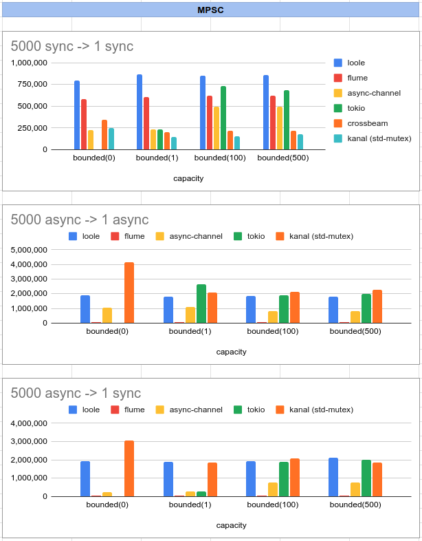
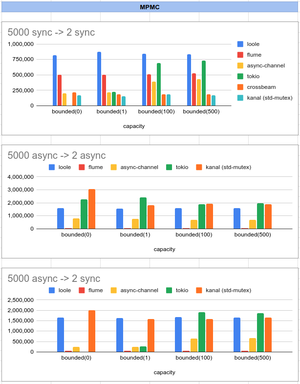
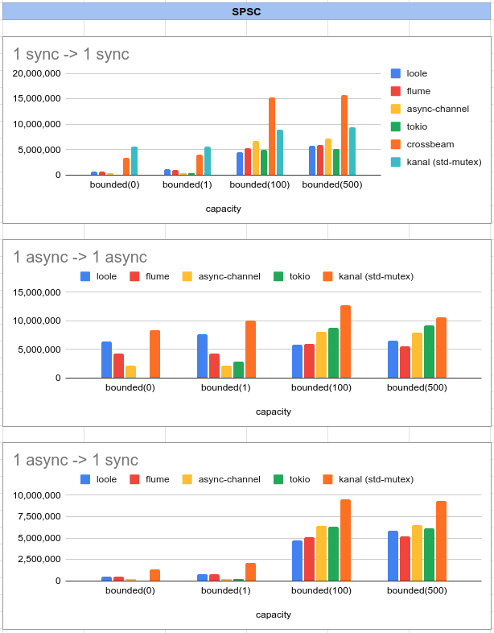

# Loole

A safe async/sync multi-producer multi-consumer channel.


[](https://docs.rs/loole)
[](https://crates.io/crates/loole)
[](https://github.com/mahdi-shojaee/loole)

Producers can send and consumers can receive messages asynchronously or synchronously:

- `sync -> sync`
- `async -> async`
- `sync -> async`
- `async -> sync`

```rust
fn main() {
    let (tx, rx) = loole::unbounded();

    std::thread::spawn(move || {
        for i in (0..10) {
            tx.send(i).unwrap();
        }
    });

    let mut sum = 0;
    while let Ok(i) = rx.recv() {
        sum += i;
    }

    assert_eq!(sum, (0..10).sum());
}
```

## Usage

To use Loole, place the following line under the `[dependencies]` section in your `Cargo.toml`:

```toml
loole = "0.1.3"
```

## Benchmarks

Benchmarks measure throughput, which is the number of messages sent and received per second, for messages of 264 bytes each.

### MPSC

5000 producers send messages to 1 consumer.

Measures: Messages per seconds. (higher is better)
Messages size: 264 bytes.



### MPMC

5000 producers send messages to 2 consumers.

Measures: Messages per seconds. (higher is better)
Messages size: 264 bytes.



### SPSC

1 producer send messages to 1 consumer.

Measures: Messages per seconds. (higher is better)
Messages size: 264 bytes.



## License

Loole is licensed under either of:

- Apache License 2.0, (http://www.apache.org/licenses/LICENSE-2.0)

- MIT license (http://opensource.org/licenses/MIT)
