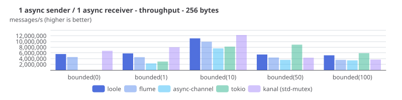
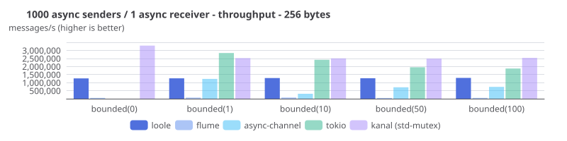
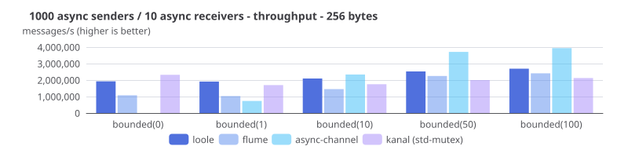
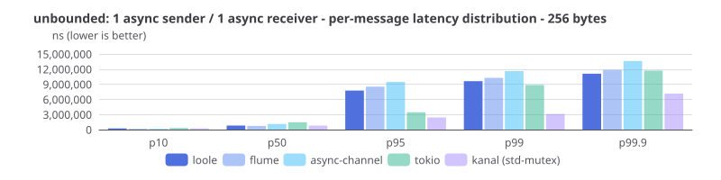
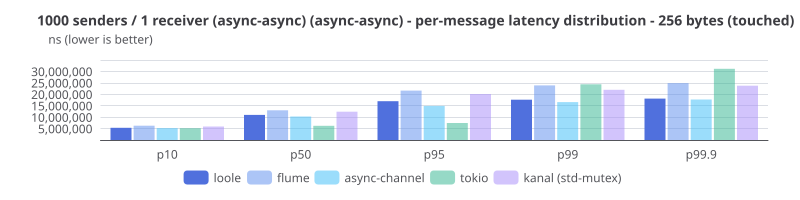
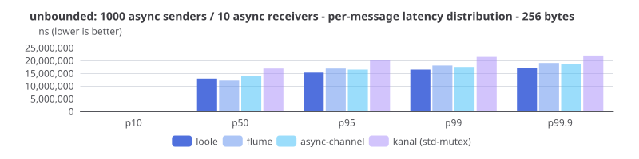

# Loole

A safe async/sync multi-producer multi-consumer channel.


[](https://docs.rs/loole)
[](https://crates.io/crates/loole)
[](https://github.com/mahdi-shojaee/loole#license)

```rust
// Async — requires an async runtime such as tokio
#[tokio::main]
async fn main() {
    let (tx, rx) = loole::unbounded();

    tokio::spawn(async move {
        for i in 0..10 {
            tx.send_async(i).await.unwrap();
        }
    });

    let mut sum = 0;
    while let Ok(i) = rx.recv_async().await {
        sum += i;
    }

    assert_eq!(sum, (0..10).sum());
}
```

```rust
// Sync
fn main() {
    let (tx, rx) = loole::unbounded();

    std::thread::spawn(move || {
        for i in 0..10 {
            tx.send(i).unwrap();
        }
    });

    let mut sum = 0;
    while let Ok(i) = rx.recv() {
        sum += i;
    }

    assert_eq!(sum, (0..10).sum());
}
```

## Why Loole?

* **Featureful**: Unbounded, bounded and rendezvous channels
* **Safe**: no `unsafe` code (`#![forbid(unsafe_code)]`)
* **Capable**: Send and receive operations can be blocking (sync) or non-blocking (async)
* **Simple**: Minimal dependencies, fast to compile

## Usage

To use Loole, place the following line under the `[dependencies]` section in your `Cargo.toml`:

```toml
loole = "0.6"
```

## Run Benchmarks

Benchmarks measure two metrics:

* **Throughput** — the number of messages received per second (higher is better).
* **Latency** — the round-trip time for a message to travel from a sender to a receiver and back, in nanoseconds per round trip (lower is better), measured with a single sender/receiver pair exchanging messages back and forth.

Measurements are driven by [Criterion.rs](https://github.com/bheisler/criterion.rs): warm-up, sampling, outlier detection, confidence intervals, and regression reports built in. For how to run the suite, configure workloads, and regenerate the charts below, see [BENCHMARK.md](BENCHMARK.md).

### Environment

Reference numbers were measured on Ubuntu Server 26.04.1 LTS with an Intel
Core i7-13700K (each run records its toolchain in its machine descriptor,
`target/criterion/runs/machine-*.json`, field `rustc_version`):

```bash
taskset -c "0,2,4,6,8,10,12,14" cargo bench -p benchmark --bench criterion_benchmarks -- --worker-threads 8 --crates "flume async-channel tokio kanal crossbeam-channel loole" --isolate-crates --sample-size 10 --measurement-time 5 --warm-up-time 0.5 -m 256
```

The charts below render the default `touched` mode: each message is a
distinct allocation with every byte filled, modeling real payloads whose
bytes are all touched (see [BENCHMARK.md](BENCHMARK.md)).

## Benchmark Results

Results live in two files:

- [Throughput](THROUGHPUT-RESULTS.md) — messages/s per topology and combo.
- [Latency](LATENCY-RESULTS.md) — SPSC ping-pong round trips plus per-message
  queueing-delay distributions under load.

### Highlights

Flagship async shapes (full galleries in the files above):

#### Throughput





[Full throughput charts →](THROUGHPUT-RESULTS.md)

#### Latency





[Full latency charts →](LATENCY-RESULTS.md)

## License

Licensed under either of

 * Apache License, Version 2.0
   ([LICENSE-APACHE](LICENSE-APACHE) or https://www.apache.org/licenses/LICENSE-2.0)
 * MIT license
   ([LICENSE-MIT](LICENSE-MIT) or https://opensource.org/licenses/MIT)

at your option.

## Contribution

Unless you explicitly state otherwise, any contribution intentionally submitted
for inclusion in the work by you, as defined in the Apache-2.0 license, shall be
dual licensed as above, without any additional terms or conditions.
