# Loole

A safe async/sync multi-producer multi-consumer channel.


[](https://docs.rs/loole)
[](https://crates.io/crates/loole)
[](https://github.com/mahdi-shojaee/loole)

```rust
fn main() {
    let (tx, rx) = loole::unbounded();

    std::thread::spawn(move || {
        for i in 0..10 {
            tx.send(i).unwrap();
        }
    });

    let mut sum = 0;
    while let Ok(i) = rx.recv() {
        sum += i;
    }

    assert_eq!(sum, (0..10).sum());
}
```

## Why Loole?

* **Fast**: Excels in high-contention environments with many concurrent producers and consumers. (Benchmark results available below)
* **Featureful**: Unbounded, bounded and rendezvous channels
* **Safe**: No unsafe code: `#![forbid(unsafe_code)]`!
* **Capable**: Send and receive operations can be blocking (sync) or non-blocking (async)
* **Familiar**: Compatible with the Flume's API
* **Simple**: No dependencies, fast to compile

## Usage

To use Loole, place the following line under the `[dependencies]` section in your `Cargo.toml`:

```toml
loole = "0.3.1"
```

## Run Benchmarks

Benchmarks measure throughput, which is the number of messages sent and received per second, for messages of 264 bytes each.

To run benchmarks on your local machine, run the following command:

_Prior to executing this command, ensure Node.js is installed._

```bash
cargo run --release -p benchmark
```

The above command will generate and update the benchmark images in the README.md file.

## Benchmark Results

Benchmark results on:

OS: Ubuntu Linux 23.10, Kernel: 6.5.0-13

CPU: Intel Core i7-13700K (16/24-core/thread)

### MPSC

Measures: Messages per second. (higher is better)

Messages size: 264 bytes.

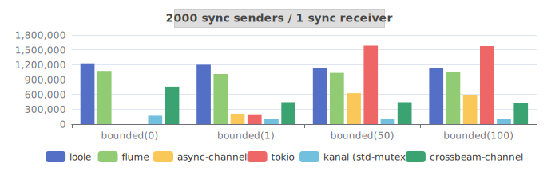
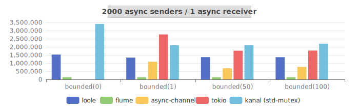
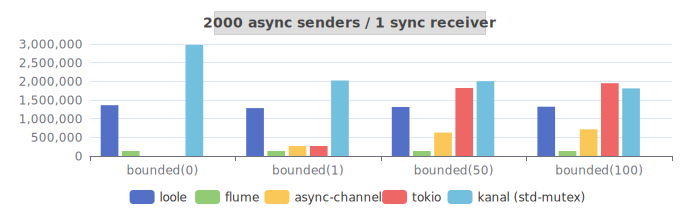
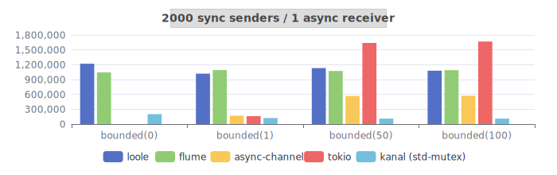

### MPMC

Measures: Messages per second. (higher is better)

Messages size: 264 bytes.

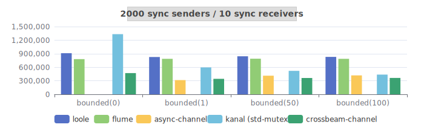
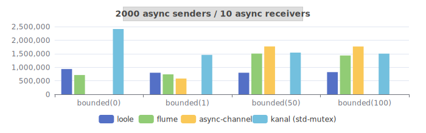
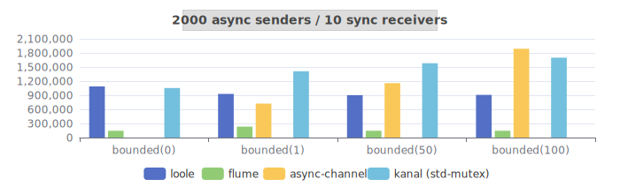
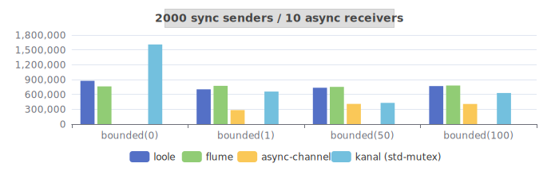

### SPSC

Measures: Messages per second. (higher is better)

Messages size: 264 bytes.

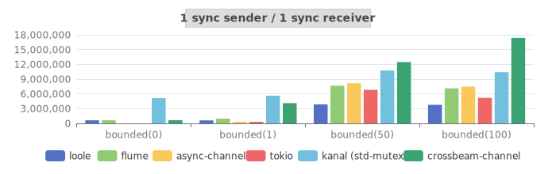
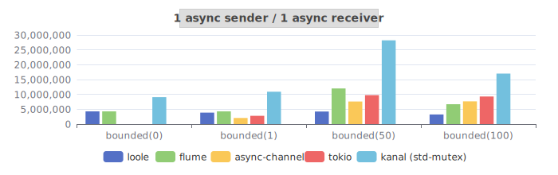
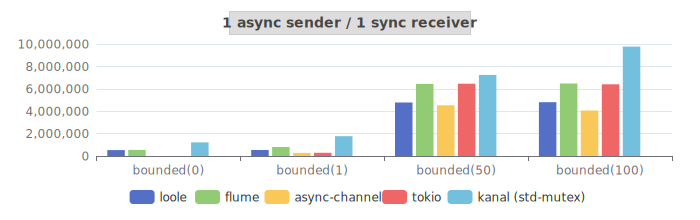
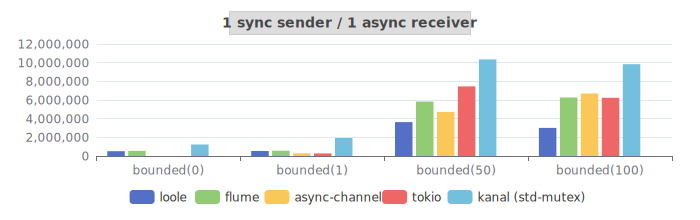

## License

This project is licensed under the [MIT license].

[MIT license]: https://github.com/mahdi-shojaee/loole/blob/master/LICENSE
